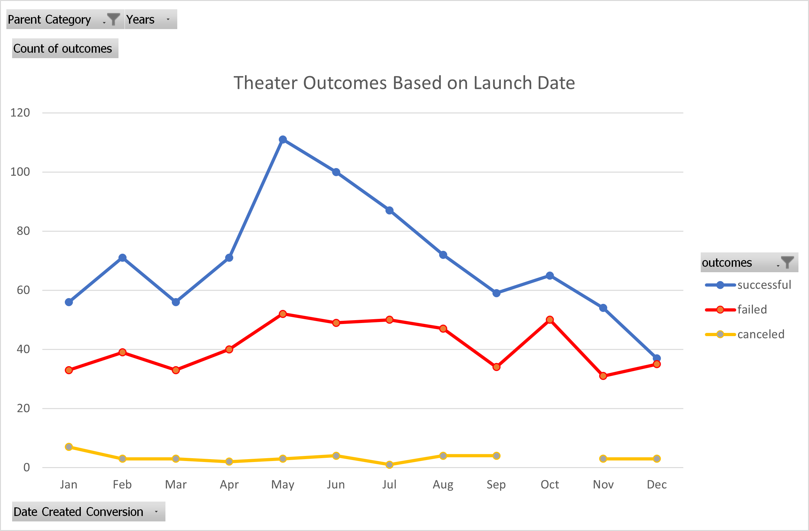
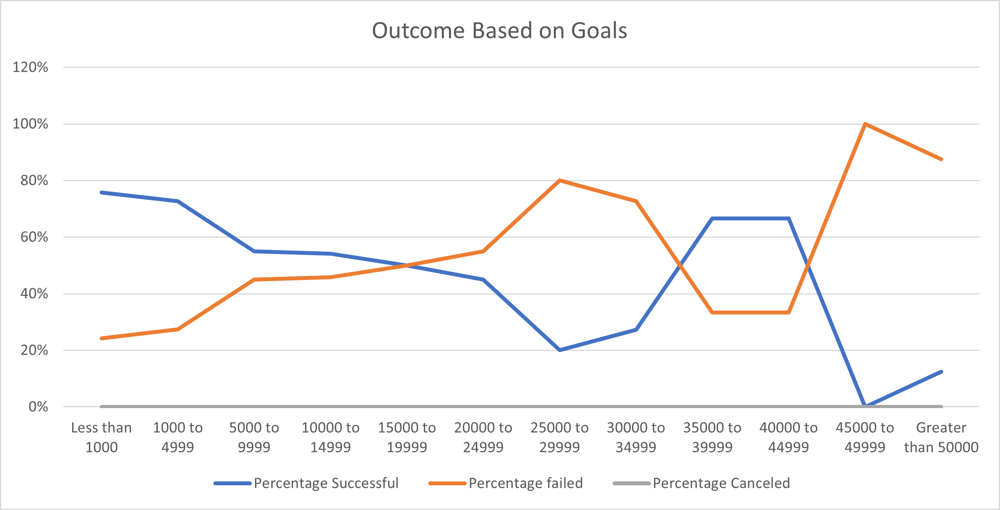

# Kickstarting with Excel

## Overview of Project

An analysis of Kickstarter campaigns to uncover outcomes based on goals and outcomes based on launch date.

### Purpose

Client wants to know how different campaigns fared in relations to their launch dates and their funding goals. Using the provided dataset of Kickstarter campaigns we will provide visualizations of campaign outcomes based on their launch dates and their funding goals. The following is a reports based on the analysis and visualizations.

## Analysis and Challenges

### Analysis of Outcomes Based on Launch Date

Using Excel we analyzed campaign outcomes based on launch date. The pivot table created allows the client to see the data organized by month and the count of the campaign outcomes by successful, failed and canceled. The client is also able to filter the data by parent category. The saved pivot table is currently filtering by "theater."

The filtered data was also used to create a line chart visualization to show the trends based on outcomes and launch date. This data can be filtered by parent category and also by years.

### Analysis of Outcomes Based on Goals

Using Excel we analyzed campaign outcomes based on goals. A new worksheet was created to analyze the date the data based on Campaign Goal, outcome (Successful, Failed, Canceled), Total Projects, and the  percentage of the outcomes as it relates to the campaign goal.

A line chart visualization was created to show trends based on goal funding ranges and the outcomes of the campaigns within those ranges.

### Challenges and Difficulties Encountered

Overall the client provided data that required minimal cleanup, organization and adjustments. Dates were required to be converted in order to provide more accessible analysis and visualizations.

## Results

- What are two conclusions you can draw about the Outcomes based on Launch Date?
  - Analysis shows that campaigns launched at the start of the summer months have a more likely outcome to be funded successfully.
  - Campaigns that are launched in the winter month have a declining success rate and a higher likelihood to fail in their funding goals. 
- What can you conclude about the Outcomes based on Goals?
  - Analysis shows that campaigns that have a lower funding goal have a high percentage of success that declines over the range. There is also an increased rate of failure when the goal is 45,000 or greater.
  - Although the lower funding goals decline over the range, there is also a "sweet spot" for the client in the 35,000 to 44,999 range.  
- What are some limitations of this dataset?
  - Overall there were little to no limits that were met when analyzing this data set and the deliverables required by the client.
- What are some other possible tables and/or graphs that we could create?
  - The are a variety of tables and graphs that can be created to visualize more information from the data set. Data can be filtered by other categories and parent categories, country, backer data, and donation.
